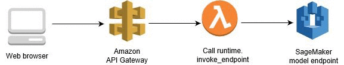
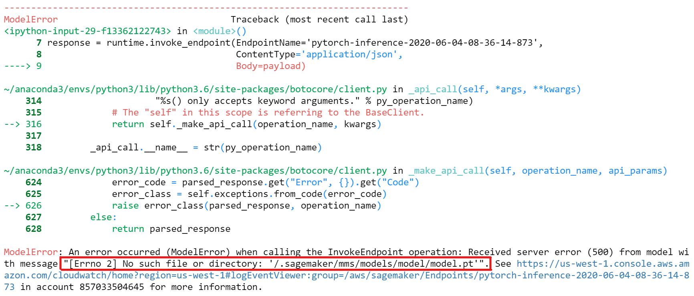
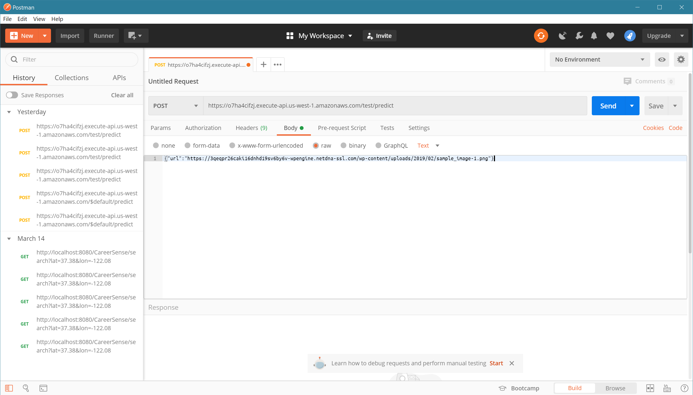

# Inference of Mobilenetv2 Model on AWS SageMaker
This project is a deployed and pretrained Movilenetv2 model on CIFAR10 and is hosted on AWS SageMaker and can be interacted via AWS API Gateway



## To use the deployed model
Since the endpoints of the deployed models on AWS SageMaker are scoped to an individual account, and can not be made public, to use the deployed model, you can either:
1. Create an endpoint on your account. OR
2. Use HTTP request via AWS API Gateway and Lambda function implemented for a deployed endpoint.

This model recieves a image URL and gives prediction in a form of probabilities of the top three categories that this model deems it belongs to.
### To use the model endpoint on your own account
1. Open the Amazon SageMaker console at [https://console.aws.amazon.com/sagemaker/](https://console.aws.amazon.com/sagemaker/).

2. Create a notebook instance.<br/>
a. For **Instance Type** choose `ml.t2.medium`<br/>
b. For **IAM role**, choose **Create a new role**, then choose **Create role**.

3. Upload `model/code/inference.py` in this repository to the notebook instance, create a `Deploy.ipynb` in the same directory.

4. In `Deploy.ipynb`, create an endpoint by running:
	```python
	from sagemaker import get_execution_role
	from sagemaker.pytorch import PyTorchModel
	
	role = get_execution_role()

	pytorch_model = PyTorchModel(model_data='s3://sagemaker-fova-bucket/model.tar.gz', role=role,
	                             entry_point='inference.py', framework_version='1.4.0')

	predictor = pytorch_model.deploy(instance_type='ml.t2.medium', initial_instance_count=1)
	```
	*Note:*<br/>
	a. This process will take about 15 mins.<br/>
	b. Since this is a sample project, I set the read permission of the model file on S3 to public, so you can use it directly.
	
5. Get real time predictions by calling an inference endpoint and passing a request payload in JSON format.

	*Note:* here's the code that prompts me an error, :(
	```python
	import boto3
	import json

	runtime = boto3.client('runtime.sagemaker')
	
	# pass a sample CIFAR10 image URL in json formatt to  
	payload = json.dumps({'url':'https://3qeqpr26caki16dnhd19sv6by6v-wpengine.netdna-ssl.com/wp-content/uploads/2019/02/sample_image-1.png'})
	
	response = runtime.invoke_endpoint(EndpointName='<CHANGE TO YOUR ENDPOINT NAME>',
	                                   ContentType='application/json',
	                                   Body=payload)
	```
	Which yields:
    
	The code directly related to this error is in `line 148, inference.py`:
	```python
	def model_fn(model_dir):
		# ...
		with open(os.path.join(model_dir, 'model.pt'), 'rb') as f:
			model.load_state_dict(torch.load(f))
	```
### To use the model directly via HTTP request (No prior steps needed)
*Note:* It is only because of the same error described above, this approach does not work correctly yet.


In Postman, POST an HTTP request:
`https://o7ha4cifzj.execute-api.us-west-1.amazonaws.com/test/predict`

In the request body,  input your data point
`{"url":"<your image url>"}`
Some example images:
`https://blog.otoro.net/assets/20160406/png/frog/frog_5_thumb.png`
`https://www.budgetchauffeurdrive.com.au/media/c5d7408b7b38bed081f4cd8178fe5996.png?preset=m-thumb`
`https://3qeqpr26caki16dnhd19sv6by6v-wpengine.netdna-ssl.com/wp-content/uploads/2019/02/sample_image-1.png`

The result will be returned in the response.
